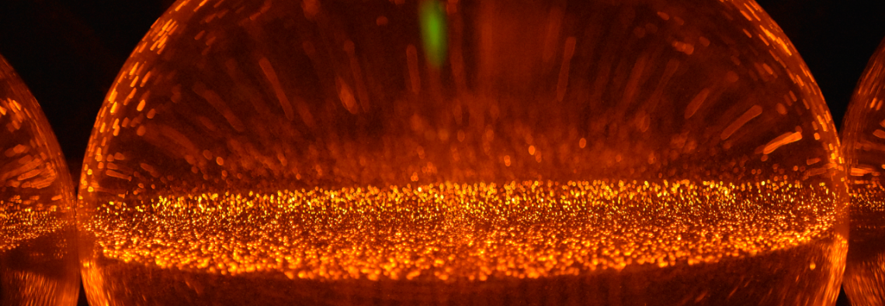

---
title: "Thomas Le Reun"
author:
  - The Zettlr Team
  - Framatophe (trad.)
date: 2020-07-04
keywords:
id: index

...

# Thomas Le Reun

I am presently a R&D engineer at Saint-Gobain Research in Paris. My main expertise lies in fluid dynamics with a particular focus on turbulence, heat transport and non-linear dynamics. In the past, I have used numerical simulations, experiments and theoretical models to tackle problems that arise in geo- and astrophysical contexts. For instance, my former research projects include tidally driven turbulence in planetary cores or porous-fluid convection in icy satellites. You may find out more scrolling through my [publications list](publications.md). 

### A short CV

Before moving to Saint-Gobain Research, I was a *Royal Society Newton International Fellow* at the University of Cambridge. Before that, I was a PhD student at *IRPHÉ* in Marseille. Please visit my [CV](CV.md) page to find out more. 
